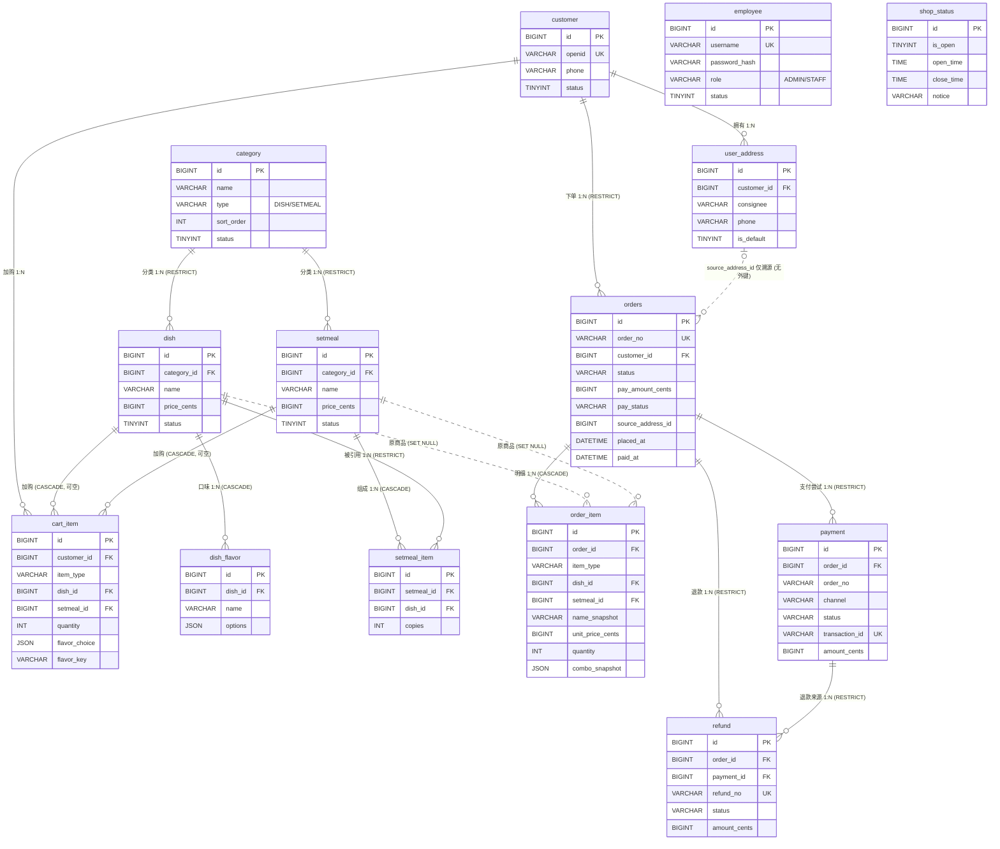

# 苍穹外卖 v2 · 数据库设计

> **语义来源**:[`01-domain.md`](./01-domain.md)。本文件与 `01-domain.md` 冲突时以 `01-domain.md` 为准。
> **落地脚本**:`backend/src/main/resources/db/migration/V1__init_schema.sql`(结构)、`V2__seed_dev.sql`(开发种子)。
> 目标环境:**MySQL 8.4** + `InnoDB` + `utf8mb4` / `utf8mb4_0900_ai_ci`。

---

## 1. 设计约定

### 1.1 主键与命名

| 约定 | 内容 |
|---|---|
| 主键 | 全表统一 `id BIGINT NOT NULL AUTO_INCREMENT` |
| 表名 | 一律**单数**(`employee`、`customer`、`category`、`dish`…);唯一例外是订单主表 `orders`,因为 `order` 是 SQL 保留字(领域文档 §3.8 表名) |
| 列名 | 全小写蛇形;布尔标记用 `is_*`;时间点用 `*_at`;金额用 `*_cents` |
| 外键列 | 统一 `<被引用表名单数>_id`(`dish_id`、`setmeal_id`、`customer_id`…) |
| 标识符 | 迁移脚本中所有标识符都加反引号,规避 `role`/`status`/`type`/`options` 等关键字歧义 |

### 1.2 审计四件套

**每一张业务表**(含 `shop_status`、`payment`、`refund` 这些配置/日志型表)都带有同样四列,没有例外:

```sql
`created_at` DATETIME NOT NULL DEFAULT CURRENT_TIMESTAMP,
`updated_at` DATETIME NOT NULL DEFAULT CURRENT_TIMESTAMP ON UPDATE CURRENT_TIMESTAMP,
`created_by` BIGINT   NULL COMMENT '创建人 id,系统写入为 NULL',
`updated_by` BIGINT   NULL COMMENT '最后更新人 id,系统写入为 NULL'
```

取舍说明:

- `created_by` / `updated_by` **不建外键**。它们可能指向 `employee.id`(管理端写)或 `customer.id`(顾客写),也可能是系统/支付回调(NULL)。一张表挂两个可选外键既表达不了"二选一",又会让删除员工/顾客时被审计列卡住。因此按"审计留痕"语义存裸 id,配合订单快照与流水表满足追溯需求。
- `updated_at` 由数据库 `ON UPDATE CURRENT_TIMESTAMP` 维护,应用层不必手写。
- 领域文档 §3.5 / §3.6 / §3.9 的 `dish_flavor` / `setmeal_item` / `order_item` 字段表**没有**列出审计四件套(它们被视为聚合内值对象),但按"审计四件套在每张业务表上统一存在"的约定,这三张表同样补齐。

### 1.3 枚举与布尔标记

分两类处理,边界清晰:

**(a) 多值枚举 → `VARCHAR` 存字符串字面量,不用 TINYINT 数字编码。**
理由:旧库 `orders.status` 用 `1..6`,数字含义只存在于代码里,查库、看日志、写报表都要对照枚举表;字符串状态自解释,且新增状态不需要重排编码。涉及的列:

| 表.列 | 合法值 |
|---|---|
| `employee.role` | `ADMIN`(超管)、`STAFF`(普通员工) |
| `category.type` | `DISH`(菜品分类)、`SETMEAL`(套餐分类) |
| `cart_item.item_type` | `DISH`、`SETMEAL` |
| `order_item.item_type` | `DISH`、`SETMEAL` |
| `orders.status` | `PENDING_PAYMENT`、`PENDING_ACCEPTANCE`、`ACCEPTED`、`DELIVERING`、`COMPLETED`、`CANCELLED` |
| `orders.pay_status` | `UNPAID`、`PAID`、`REFUNDED`、`PARTIAL_REFUNDED` |
| `orders.pay_method` | `WECHAT`、`MOCK`(未支付为 `NULL`) |
| `orders.cancel_side` | `CUSTOMER`、`MERCHANT`、`SYSTEM`(未取消为 `NULL`) |
| `payment.channel` | `WECHAT`、`MOCK` |
| `payment.status` | `PENDING`、`SUCCESS`、`FAILED`、`CLOSED` |
| `refund.status` | `PENDING`、`SUCCESS`、`FAILED` |
| `refund.reason_type` | `MERCHANT_REJECT`、`MERCHANT_CANCEL`、`CUSTOMER_APPLY`、`OTHER`(可空) |

**(b) 二值启停标记 → 沿用领域文档 §3 的写法 `TINYINT`,取值只有 1/0。**

| 表.列 | 合法值 |
|---|---|
| `employee.status` | 1 启用 / 0 禁用 |
| `customer.status` | 1 正常 / 0 封禁 |
| `user_address.is_default` | 1 默认 / 0 非默认 |
| `category.status` | 1 启用 / 0 禁用 |
| `dish.status` | 1 起售 / 0 停售 |
| `setmeal.status` | 1 起售 / 0 停售 |
| `shop_status.is_open` | 1 营业中 / 0 已打烊 |

领域文档 §3 对这批列显式给出的是 `TINYINT` + `1`/`0` 两个值(不是多值状态机),所以保留 `TINYINT` 是对文档最忠实的落地。若后续要求"所有状态一律字符串",改动面是这 7 列 + 对应 CHECK + 应用层枚举,一条 `V3__` 迁移即可完成,不影响其它表。

**(c) 枚举值一律用 `CHECK` 约束在库层面兜住。**
MySQL 8.0.16+ 真正执行 `CHECK`,`IN (...)` 是确定性的,所以每个枚举列都在 DDL 里限定了取值域(见 §3 各表)。注意 `CHECK` 只校验**取值合法**,不校验**状态迁移合法**——状态机仍然只在后端 `OrderStateMachine` 里(领域文档 §4:"DB 不做约束"),比如 `COMPLETED → CANCELLED` 数据库拦不住,那是领域层的职责。

### 1.4 金额

- 所有金额列 `BIGINT NOT NULL`,列名以 `_cents` 结尾,**单位是分**,存储与传输都是整数(领域文档 D1)。
- 展示层除以 100,四舍五入规则不进数据库。
- 订单侧 5 列共同构成金额模型:`total_amount_cents + pack_amount_cents + delivery_amount_cents - discount_amount_cents = pay_amount_cents`,由服务端按数据库当前价重算(R5),请求体金额不信任。
- `discount_amount_cents` 默认 0,是 v2 的预留位(优惠券/满减在 §7 明确不做)。
- 所有金额列都有 `>= 0` 的 `CHECK`;金额列不做 `UNSIGNED`,以免表达式计算时出现隐式转换陷阱。

### 1.5 时间与时区

- 时间列一律 `DATETIME`(不是 `TIMESTAMP`):`TIMESTAMP` 有 2038 上限且随会话时区隐式转换,`DATETIME` 存的是"墙上时间",语义确定。
- **写库时区 `Asia/Shanghai`**,由三处共同保证:
  1. `docker-compose.yml` 的 MySQL 启动参数 `--default-time-zone=+08:00`;
  2. 迁移脚本头部 `SET time_zone = '+08:00'`,让建表默认值与种子数据的时间不受服务器配置影响;
  3. JDBC 连接串显式声明 `connectionTimeZone=Asia/Shanghai`(Connector/J 8.0.23+;旧版为 `serverTimezone=Asia/Shanghai`)。
- 因此 `CURRENT_TIMESTAMP` 落库就是北京时间,`created_at`/`placed_at` 等默认值可信。
- 订单不靠单一时间列,而是**每个状态一个时间戳列**(`paid_at`/`accepted_at`/`delivering_at`/`completed_at`/`cancelled_at`),这是领域文档 §3.8 对旧库 `order_time`/`checkout_time`/`delivery_time`/`cancel_time` 语义混乱的有意修正。

### 1.6 无软删除

按领域文档 D13:

- 没有任何 `is_deleted` / `deleted_at` 列。
- "禁用/停售"由 `status` 表达,是业务状态,不是删除。
- 真删除由外键行为兜底:聚合内部件 `CASCADE`(`dish_flavor`、`setmeal_item`、`cart_item`、`order_item`(随订单)、`user_address`),被引用的主数据 `RESTRICT`(`dish.category_id`、`setmeal.category_id`、`setmeal_item.dish_id`、`orders.customer_id`、`payment`/`refund`)。
- 历史可追溯性由**订单快照**保证:商品被删除后,`order_item.dish_id` 被置 `NULL`,但 `name_snapshot`/`unit_price_cents`/`combo_snapshot` 仍然完整还原下单那一刻。
- 副作用(值得知道):`RESTRICT` 意味着"已被订单引用过的顾客无法物理删除"。这正是想要的效果——要么先处理订单,要么改用 `customer.status=0` 封禁。

### 1.7 引擎与字符集

每张表统一 `ENGINE=InnoDB DEFAULT CHARSET=utf8mb4 COLLATE=utf8mb4_0900_ai_ci`,表与列都写 `COMMENT`。`utf8mb4_0900_ai_ci` 是 MySQL 8 默认排序规则,中文与 emoji 均正常;`ai_ci` 表示重音/大小写不敏感,因此"川湘菜"与"川湘菜 "(尾部空格)在唯一键上等价,重名拦截更严格。

---

## 2. 表清单总览

共 **14 张表**,与领域文档 §3 的 13 个实体一一对应(`Order` 拆成 `orders` + `order_item`,`ShopStatus` 单行表)。

| # | 表名 | 中文名 | 限界上下文 | 说明 |
|---|---|---|---|---|
| 1 | `employee` | 员工 | 身份 Identity | 管理端账号,`role` 区分 `ADMIN`/`STAFF`,有密码 |
| 2 | `customer` | 顾客 | 身份 Identity | 小程序用户,微信 `openid` 登录,无密码 |
| 3 | `user_address` | 收货地址 | 顾客资料 Profile | 顾客地址簿,每顾客至多一条默认地址 |
| 4 | `category` | 分类 | 商品 Catalog | 菜品分类与套餐分类同表,`type` 区分 |
| 5 | `dish` | 菜品 | 商品 Catalog | 单品,含价格、图片、起售状态 |
| 6 | `dish_flavor` | 菜品口味 | 商品 Catalog | 口味维度与选项(**JSON 数组**) |
| 7 | `setmeal` | 套餐 | 商品 Catalog | 独立商品,手工定价 |
| 8 | `setmeal_item` | 套餐组成 | 商品 Catalog | 套餐含哪些菜品、各几份 |
| 9 | `cart_item` | 购物车行 | 购物车 Cart | 只存"意图"(商品引用+数量+口味),不快照 |
| 10 | `orders` | 订单 | 订单 Ordering | 主表:金额、状态、地址快照、各状态时间戳 |
| 11 | `order_item` | 订单明细 | 订单 Ordering | **不可变快照**:名称/图片/单价/口味/套餐组成 |
| 12 | `payment` | 支付流水 | 订单 Ordering | 渠道、状态、平台单号(幂等键)、原始回调 |
| 13 | `refund` | 退款流水 | 订单 Ordering | 退款单号、状态、原因、原始回调 |
| 14 | `shop_status` | 店铺营业状态 | 门店 Shop | 单行配置 `id=1`,营业状态与公告 |

**没有建表**的部分(刻意,见领域文档 §2 / §7):

- 报表/统计表:Insights 上下文是订单的投影(D8),不建第二份会漂移的真相。
- 通知/WebSocket 状态:无持久化,来单提醒走内存 + Redis。
- 库存表:不做库存扣减(D12)。
- 优惠券/评价/骑手/售后工单:明确不在本期范围(§7)。

---

## 3. 逐表字段说明

图例:可空列 `是`/`否`;`默认` 列 `—` 表示无默认值。

### 3.1 `employee` 员工

| 字段 | 类型 | 可空 | 默认 | 说明 |
|---|---|---|---|---|
| `id` | BIGINT | 否 | AUTO_INCREMENT | 主键 |
| `username` | VARCHAR(32) | 否 | — | 登录名,**唯一** |
| `password_hash` | VARCHAR(100) | 否 | — | BCrypt 哈希,不存明文 |
| `name` | VARCHAR(32) | 否 | — | 姓名 |
| `phone` | VARCHAR(20) | 是 | NULL | 手机号 |
| `role` | VARCHAR(16) | 否 | — | `ADMIN` / `STAFF` |
| `status` | TINYINT | 否 | 1 | 1 启用 / 0 禁用 |
| `last_login_at` | DATETIME | 是 | NULL | 最近登录时间 |
| `created_at` / `updated_at` | DATETIME | 否 | CURRENT_TIMESTAMP | 审计四件套 |
| `created_by` / `updated_by` | BIGINT | 是 | NULL | 审计四件套(操作人 `employee.id`) |

- 唯一键:`uk_employee_username (username)` —— 登录名全局唯一,登录查询与重名拦截共用。
- 外键:无。
- CHECK:`ck_employee_role`、`ck_employee_status`。
- 关键点:角色是**显式字段**,不是"用户名等于 admin 就是超管"(领域文档 §3.1)。

### 3.2 `customer` 顾客

| 字段 | 类型 | 可空 | 默认 | 说明 |
|---|---|---|---|---|
| `id` | BIGINT | 否 | AUTO_INCREMENT | 主键 |
| `openid` | VARCHAR(64) | 否 | — | 微信 openid,**唯一** |
| `nickname` | VARCHAR(64) | 是 | NULL | 微信昵称(微信可能不返回,故可空) |
| `avatar_url` | VARCHAR(255) | 是 | NULL | 头像 |
| `phone` | VARCHAR(20) | 是 | NULL | 手机号,下单时补 |
| `status` | TINYINT | 否 | 1 | 1 正常 / 0 封禁 |
| `last_login_at` | DATETIME | 是 | NULL | 最近登录时间 |
| `created_at` / `updated_at` | DATETIME | 否 | CURRENT_TIMESTAMP | 审计四件套 |
| `created_by` / `updated_by` | BIGINT | 是 | NULL | 审计四件套 |

- 唯一键:`uk_customer_openid (openid)` —— 一个微信账号只有一份顾客档案;并发首登时靠它兜住重复建档。
- 外键:无。**没有密码列**(领域文档 §3.2:唯一登录方式是微信授权)。

### 3.3 `user_address` 收货地址

| 字段 | 类型 | 可空 | 默认 | 说明 |
|---|---|---|---|---|
| `id` | BIGINT | 否 | AUTO_INCREMENT | 主键 |
| `customer_id` | BIGINT | 否 | — | 所属顾客 → `customer.id` |
| `consignee` | VARCHAR(32) | 否 | — | 收货人 |
| `phone` | VARCHAR(20) | 否 | — | 收货人手机号 |
| `province` | VARCHAR(32) | 否 | — | 省 |
| `city` | VARCHAR(32) | 否 | — | 市 |
| `district` | VARCHAR(32) | 否 | — | 区/县 |
| `detail` | VARCHAR(255) | 否 | — | 详细地址 |
| `label` | VARCHAR(16) | 是 | NULL | 约定取值 `家` / `公司` / `学校`,允许自定义 |
| `is_default` | TINYINT | 否 | 0 | 1 默认 / 0 非默认 |
| `created_at` / `updated_at` | DATETIME | 否 | CURRENT_TIMESTAMP | 审计四件套 |
| `created_by` / `updated_by` | BIGINT | 是 | NULL | 审计四件套 |

- 外键:`fk_user_address_customer` → `customer(id)` **ON DELETE CASCADE**(顾客注销,地址簿一并消失)。
- CHECK:`ck_user_address_is_default`。
- **"每顾客至多一条默认地址"由应用层保证**(领域文档 §3.3:设置默认时先清空本人其它默认,同一事务内完成)。数据库无法用唯一索引表达"至多一条 `is_default=1`",因为 `(customer_id, is_default)` 上建唯一键会把"多条非默认地址"也一起挡掉。索引 `idx_user_address_customer (customer_id, is_default)` 让"取默认地址""清空默认"都走索引。

### 3.4 `category` 分类

| 字段 | 类型 | 可空 | 默认 | 说明 |
|---|---|---|---|---|
| `id` | BIGINT | 否 | AUTO_INCREMENT | 主键 |
| `name` | VARCHAR(32) | 否 | — | 分类名,**同 type 内唯一** |
| `type` | VARCHAR(16) | 否 | — | `DISH` / `SETMEAL` |
| `sort_order` | INT | 否 | 0 | 越小越前 |
| `status` | TINYINT | 否 | 1 | 1 启用 / 0 禁用 |
| `created_at` / `updated_at` | DATETIME | 否 | CURRENT_TIMESTAMP | 审计四件套 |
| `created_by` / `updated_by` | BIGINT | 是 | NULL | 审计四件套 |

- 唯一键:`uk_category_type_name (type, name)` —— "同类型下名称唯一"(领域文档 §3.4),菜品分类里可以有"套餐"这个名字而不与套餐分类冲突。
- 外键:无(被 `dish` / `setmeal` 引用,`RESTRICT`)。
- CHECK:`ck_category_type`、`ck_category_status`。
- 「`dish.category_id` 必须指向 `type=DISH` 的分类」是**跨表规则**,MySQL 的 `CHECK` 不能查其它表,由应用层保证(领域文档 §3.5 括注)。

### 3.5 `dish` 菜品

| 字段 | 类型 | 可空 | 默认 | 说明 |
|---|---|---|---|---|
| `id` | BIGINT | 否 | AUTO_INCREMENT | 主键 |
| `category_id` | BIGINT | 否 | — | → `category.id`(必须是 `type=DISH` 的分类) |
| `name` | VARCHAR(64) | 否 | — | **同分类内唯一** |
| `price_cents` | BIGINT | 否 | — | 售价,**单位:分** |
| `image_url` | VARCHAR(255) | 是 | NULL | 图片地址 |
| `description` | VARCHAR(255) | 是 | NULL | 描述 |
| `status` | TINYINT | 否 | 0 | 1 起售 / 0 停售(**新建默认停售**,上架需显式操作) |
| `sort_order` | INT | 否 | 0 | 越小越前 |
| `created_at` / `updated_at` | DATETIME | 否 | CURRENT_TIMESTAMP | 审计四件套 |
| `created_by` / `updated_by` | BIGINT | 是 | NULL | 审计四件套 |

- 唯一键:`uk_dish_category_name (category_id, name)` —— 同分类内菜品不重名。
- 外键:`fk_dish_category` → `category(id)` **ON DELETE RESTRICT**(被菜品引用的分类不可删)。
- CHECK:`ck_dish_status`、`ck_dish_price_cents`。
- 关键点:停售菜品**保留**口味配置(领域文档 §3.5),所以 `dish_flavor` 不随 `status` 变化。

### 3.6 `dish_flavor` 菜品口味

| 字段 | 类型 | 可空 | 默认 | 说明 |
|---|---|---|---|---|
| `id` | BIGINT | 否 | AUTO_INCREMENT | 主键 |
| `dish_id` | BIGINT | 否 | — | → `dish.id` |
| `name` | VARCHAR(32) | 否 | — | 口味维度名,如 `辣度` / `忌口` / `甜度` |
| `options` | JSON | 否 | — | **选项数组**,如 `["不辣","微辣","中辣","重辣"]` |
| `sort_order` | INT | 否 | 0 | 越小越前 |
| `created_at` / `updated_at` | DATETIME | 否 | CURRENT_TIMESTAMP | 审计四件套 |
| `created_by` / `updated_by` | BIGINT | 是 | NULL | 审计四件套 |

- 唯一键:`uk_dish_flavor_dish_name (dish_id, name)` —— 同一菜品的同一口味维度只有一行("辣度"不会出现两次);它同时是"取某菜品的口味配置"的索引,也是外键所需索引,所以不再另建索引。
- 外键:`fk_dish_flavor_dish` → `dish(id)` **ON DELETE CASCADE**(删菜连带删口味)。
- 关键点:`options` 用 JSON 数组而不是逗号串(领域文档 D7):选项里含逗号不会损坏,且能表达多选。**必须是数组**,`["不辣", "微辣"]` 合法,`"不辣,微辣"` 不合法;这一点由应用层 DTO 校验,数据库不做 JSON 结构断言(见 §8 待复核项)。
- 未配置口味的菜品就没有行(不是空数组行),前端读到的口味列表为空即"无需选口味"。

### 3.7 `setmeal` 套餐

| 字段 | 类型 | 可空 | 默认 | 说明 |
|---|---|---|---|---|
| `id` | BIGINT | 否 | AUTO_INCREMENT | 主键 |
| `category_id` | BIGINT | 否 | — | → `category.id`(必须是 `type=SETMEAL` 的分类) |
| `name` | VARCHAR(64) | 否 | — | **同分类内唯一** |
| `price_cents` | BIGINT | 否 | — | 套餐价(手工定价),**单位:分** |
| `image_url` | VARCHAR(255) | 是 | NULL | 图片地址 |
| `description` | VARCHAR(255) | 是 | NULL | 描述 |
| `status` | TINYINT | 否 | 0 | 1 起售 / 0 停售 |
| `created_at` / `updated_at` | DATETIME | 否 | CURRENT_TIMESTAMP | 审计四件套 |
| `created_by` / `updated_by` | BIGINT | 是 | NULL | 审计四件套 |

- 唯一键:`uk_setmeal_category_name (category_id, name)`。
- 外键:`fk_setmeal_category` → `category(id)` **ON DELETE RESTRICT**。
- CHECK:`ck_setmeal_status`、`ck_setmeal_price_cents`。
- 领域文档 §3.6 的 `Setmeal` 字段表**没有** `sort_order`,本设计不擅自添加(套餐按分类 + id 展示)。
- 「套餐价 ≤ 所含菜品单价×份数之和」是跨行聚合规则,**不在数据库约束**(需要触发器才能表达,收益不抵复杂度),由应用层在保存套餐时校验(见 §8)。

### 3.8 `setmeal_item` 套餐组成

| 字段 | 类型 | 可空 | 默认 | 说明 |
|---|---|---|---|---|
| `id` | BIGINT | 否 | AUTO_INCREMENT | 主键 |
| `setmeal_id` | BIGINT | 否 | — | → `setmeal.id` |
| `dish_id` | BIGINT | 否 | — | → `dish.id` |
| `copies` | INT | 否 | 1 | 份数,`>= 1` |
| `created_at` / `updated_at` | DATETIME | 否 | CURRENT_TIMESTAMP | 审计四件套 |
| `created_by` / `updated_by` | BIGINT | 是 | NULL | 审计四件套 |

- 唯一键:`uk_setmeal_item_setmeal_dish (setmeal_id, dish_id)` —— 领域文档 §3.6 明确要求;同一套餐里同一菜品只能出现一行,份数用 `copies` 表达而不是重复多行。
- 外键:
  - `fk_setmeal_item_setmeal` → `setmeal(id)` **ON DELETE CASCADE**(删套餐连带删组成);
  - `fk_setmeal_item_dish` → `dish(id)` **ON DELETE RESTRICT**(被套餐引用的菜品不可删)。
  - 两条规则组合出的语义:删菜品前必须先把套餐里的引用去掉,避免套餐静默缺菜。
- CHECK:`ck_setmeal_item_copies`。
- 「套餐起售前提是其菜品全部起售;停售任一菜品连带停售相关套餐(同事务)」是应用层事务规则(领域文档 §3.6),数据库只提供 `idx_setmeal_item_dish` 让"这个菜被哪些套餐引用"这条反查走索引。

### 3.9 `cart_item` 购物车行

| 字段 | 类型 | 可空 | 默认 | 说明 |
|---|---|---|---|---|
| `id` | BIGINT | 否 | AUTO_INCREMENT | 主键 |
| `customer_id` | BIGINT | 否 | — | → `customer.id` |
| `item_type` | VARCHAR(16) | 否 | — | `DISH` / `SETMEAL` |
| `dish_id` | BIGINT | 是 | NULL | → `dish.id`;`item_type=DISH` 时必填 |
| `setmeal_id` | BIGINT | 是 | NULL | → `setmeal.id`;`item_type=SETMEAL` 时必填 |
| `quantity` | INT | 否 | 1 | 数量,`>= 1` |
| `flavor_choice` | JSON | 是 | NULL | 顾客选中的口味,如 `[{"name":"辣度","option":"微辣"}]` |
| `flavor_key` | VARCHAR(64) | 否 | `''` | `flavor_choice` 的归一化哈希(键按字典序拼接),未选口味为固定空串 |
| `dish_ref_id` | BIGINT | 否 | 生成列 | **生成列** `IFNULL(dish_id, 0)`,仅供唯一键使用 |
| `setmeal_ref_id` | BIGINT | 否 | 生成列 | **生成列** `IFNULL(setmeal_id, 0)`,仅供唯一键使用 |
| `created_at` / `updated_at` | DATETIME | 否 | CURRENT_TIMESTAMP | 审计四件套 |
| `created_by` / `updated_by` | BIGINT | 是 | NULL | 审计四件套 |

**唯一键:`uk_cart_item_identity (customer_id, item_type, dish_ref_id, setmeal_ref_id, flavor_key)`** —— 领域文档 §3.7 要求"同菜同口味自动合并数量"。

#### 唯一索引的 NULL 陷阱与解法(重点)

领域文档 §3.7 写的唯一约束是 `(customer_id, item_type, dish_id, setmeal_id, flavor_key)`,其中 `dish_id` / `setmeal_id` **按类型二选一,另一个必然是 NULL**。而 SQL 标准与 MySQL 都规定**唯一索引中多个 NULL 互不相等**,于是对 `('C1','DISH', 101, NULL, 'k')` 这样的键:

- 插入第二行完全相同的 `(C1, DISH, 101, NULL, 'k')` **不会报冲突**;
- 结果是同一种菜同一口味能插出任意多行,"加购自动合并"彻底失效,购物车出现重复行。

三种候选解法对比:

| 方案 | 做法 | 评价 |
|---|---|---|
| A. 用 0 代替 NULL | `dish_id BIGINT NOT NULL DEFAULT 0` | ❌ 与 `ON DELETE CASCADE` 外键冲突:外键要求 0 能在被引用表里存在,而 `dish` 没有 id=0 |
| B. 统一引用列 | 只保留一列 `ref_id` + `item_type`,不区分菜品/套餐 | ❌ 外键指向两张表无法表达,`dish_id`/`setmeal_id` 的级联规则(§3.7 边界)会丢失 |
| **C. 生成列归一化(采用)** | 保留可空真列 + 两个 `STORED` 生成列 `IFNULL(dish_id, 0)` / `IFNULL(setmeal_id, 0)`,唯一键建在生成列上 | ✅ 真列仍可空 → 外键 `CASCADE` 保留;唯一键看到的 NULL 变成 0 → 唯一性真正生效;生成列由 MySQL 维护,应用层写不进去,不会与真列漂移 |

采用 **方案 C**,MySQL 8.4 语法(已在 8.4 上实测建表与冲突拦截):

```sql
`dish_ref_id`    BIGINT GENERATED ALWAYS AS (IFNULL(`dish_id`, 0))    STORED,
`setmeal_ref_id` BIGINT GENERATED ALWAYS AS (IFNULL(`setmeal_id`, 0)) STORED,
UNIQUE KEY `uk_cart_item_identity`
  (`customer_id`, `item_type`, `dish_ref_id`, `setmeal_ref_id`, `flavor_key`)
```

语义:键里的 `(0, 108)` = 套餐 108;`(101, 0)` = 菜品 101;`(0, 0)` 不可能出现(被下面的 CHECK 挡住)。加购语句因此可以直接用 upsert:

```sql
INSERT INTO cart_item (customer_id, item_type, dish_id, setmeal_id, quantity, flavor_choice, flavor_key)
VALUES (?, ?, ?, ?, ?, ?, ?)
ON DUPLICATE KEY UPDATE quantity = quantity + VALUES(quantity), updated_at = CURRENT_TIMESTAMP;
```

补充约束与索引:

- `ck_cart_item_ref`:强制 `item_type='DISH'` 时 `dish_id` 非空且 `setmeal_id` 为空,反之亦然——即"二选一"必须成立。它与 `ON DELETE CASCADE` 不冲突(删除商品时整行被级联删掉,不会留下违反约束的中间态)。
- `ck_cart_item_item_type`、`ck_cart_item_quantity`。
- `idx_cart_item_dish (dish_id)` / `idx_cart_item_setmeal (setmeal_id)`:既是外键索引,也服务"某商品停售/删除时要清理哪些购物车行"。
- **`flavor_key` 必须 `NOT NULL DEFAULT ''`**。若它可空,同样会踩 NULL 陷阱:顾客对同一道菜一次"选了口味"、一次"没选口味",两行的 `flavor_key` 都是 NULL,唯一键不生效,购物车又会出现重复行。空串表示"无口味选择"。
- 归一化算法(应用层,建议写进 `CartService`):把 `flavor_choice` 按 `name` 字典序排序,拼成 `name=option` 再用 `&` 连接,对结果取 SHA-256 十六进制前 64 字符(或直接存归一化串,长度不超 64)。同一份选择在任意顺序下得到同一个 key,这是唯一键能生效的前提。

### 3.10 `orders` 订单

表名用复数 `orders`:`order` 是 SQL 保留字。

| 字段 | 类型 | 可空 | 默认 | 说明 |
|---|---|---|---|---|
| `id` | BIGINT | 否 | AUTO_INCREMENT | 主键 |
| `order_no` | VARCHAR(32) | 否 | — | 业务单号,**唯一**,顾客可见 |
| `customer_id` | BIGINT | 否 | — | → `customer.id` |
| `status` | VARCHAR(24) | 否 | `PENDING_PAYMENT` | 订单状态,见 §1.3(a) |
| `total_amount_cents` | BIGINT | 否 | 0 | 商品合计(分) |
| `pack_amount_cents` | BIGINT | 否 | 0 | 打包费(分) |
| `delivery_amount_cents` | BIGINT | 否 | 0 | 配送费(分) |
| `discount_amount_cents` | BIGINT | 否 | 0 | 优惠(v2 预留,恒 0) |
| `pay_amount_cents` | BIGINT | 否 | 0 | 实付 = total + pack + delivery − discount |
| `pay_status` | VARCHAR(16) | 否 | `UNPAID` | `UNPAID`/`PAID`/`REFUNDED`/`PARTIAL_REFUNDED` |
| `pay_method` | VARCHAR(16) | 是 | NULL | `WECHAT`/`MOCK`,未支付为 NULL |
| `consignee` | VARCHAR(32) | 否 | — | **地址快照** 收货人 |
| `phone` | VARCHAR(20) | 否 | — | **地址快照** 手机号 |
| `province` | VARCHAR(32) | 否 | — | **地址快照** 省 |
| `city` | VARCHAR(32) | 否 | — | **地址快照** 市 |
| `district` | VARCHAR(32) | 否 | — | **地址快照** 区/县 |
| `detail` | VARCHAR(255) | 否 | — | **地址快照** 详细地址 |
| `source_address_id` | BIGINT | 是 | NULL | 下单时选用的 `user_address.id`,**仅溯源** |
| `remark` | VARCHAR(255) | 是 | NULL | 顾客备注 |
| `tableware_count` | INT | 否 | 1 | 餐具份数 |
| `placed_at` | DATETIME | 否 | CURRENT_TIMESTAMP | 下单时间 |
| `estimated_delivery_at` | DATETIME | 是 | NULL | 预计送达 |
| `paid_at` | DATETIME | 是 | NULL | 支付成功时间 |
| `accepted_at` | DATETIME | 是 | NULL | 接单时间 |
| `delivering_at` | DATETIME | 是 | NULL | 开始派送时间 |
| `completed_at` | DATETIME | 是 | NULL | 完成时间 |
| `cancelled_at` | DATETIME | 是 | NULL | 取消时间 |
| `cancel_side` | VARCHAR(16) | 是 | NULL | `CUSTOMER`/`MERCHANT`/`SYSTEM` |
| `cancel_reason` | VARCHAR(255) | 是 | NULL | 取消原因 |
| `created_at` / `updated_at` | DATETIME | 否 | CURRENT_TIMESTAMP | 审计四件套 |
| `created_by` / `updated_by` | BIGINT | 是 | NULL | 审计四件套 |

- 唯一键:`uk_orders_order_no (order_no)` —— 单号唯一;它同时是"回调只带 `out_trade_no` 时定位订单"和顾客端"按单号查询"的入口。
- 外键:`fk_orders_customer` → `customer(id)` **ON DELETE RESTRICT**(有订单的顾客不可物理删除,防止财务记录失去主体)。
- 索引:`idx_orders_status_placed_at`、`idx_orders_customer_status_placed_at`、`idx_orders_paid_at`,用途见 §5。
- `source_address_id` **刻意不建外键**:它是溯源字段,不是关系。顾客删掉地址后(甚至被级联删除),历史订单必须仍然完整、可读——这就是地址快照存在的理由(领域文档 §3.8)。若加外键 `RESTRICT` 会让顾客删不了地址,加 `SET NULL` 又会让溯源信息丢失,两者都不如"存裸 id + 快照"。
- 地址快照 6 列全部 `NOT NULL`:下单必经地址校验(R4:地址属于本人),不存在"无地址订单";司机/客服读单时也不必回表。
- 状态迁移的合法性**不落数据库**(领域文档 §4),`CHECK` 只保证 `status` 是 6 个合法值之一。所有迁移都在后端 `OrderStateMachine` 判定。
- `tableware_count` 允许 0(顾客自带餐具),`CHECK >= 0`。

### 3.11 `order_item` 订单明细

| 字段 | 类型 | 可空 | 默认 | 说明 |
|---|---|---|---|---|
| `id` | BIGINT | 否 | AUTO_INCREMENT | 主键 |
| `order_id` | BIGINT | 否 | — | → `orders.id` |
| `item_type` | VARCHAR(16) | 否 | — | `DISH` / `SETMEAL` |
| `dish_id` | BIGINT | 是 | NULL | 原菜品引用,**商品删除后置 NULL** |
| `setmeal_id` | BIGINT | 是 | NULL | 原套餐引用,**商品删除后置 NULL** |
| `name_snapshot` | VARCHAR(64) | 否 | — | **快照** 下单时名称 |
| `image_snapshot` | VARCHAR(255) | 是 | NULL | **快照** 下单时图片 |
| `unit_price_cents` | BIGINT | 否 | — | **快照** 下单时单价(分) |
| `quantity` | INT | 否 | — | **快照** 数量 |
| `amount_cents` | BIGINT | 否 | — | **快照** 小计 = 单价 × 数量(分) |
| `flavor_snapshot` | JSON | 是 | NULL | **快照** 下单时选中的口味 |
| `combo_snapshot` | JSON | 是 | NULL | **快照** 套餐所含菜品明细;菜品行为 NULL |
| `created_at` / `updated_at` | DATETIME | 否 | CURRENT_TIMESTAMP | 审计四件套 |
| `created_by` / `updated_by` | BIGINT | 是 | NULL | 审计四件套 |

- 外键:
  - `fk_order_item_order` → `orders(id)` **ON DELETE CASCADE**(删订单连带删明细,不会留下孤儿行);
  - `fk_order_item_dish` → `dish(id)` **ON DELETE SET NULL**;
  - `fk_order_item_setmeal` → `setmeal(id)` **ON DELETE SET NULL**。
- **这里刻意不加"`item_type` 与引用列必须匹配"的 CHECK**(与 `cart_item` 相反)。因为商品被真删除时 `dish_id` 会被数据库置为 `NULL`,`item_type` 仍是 `'DISH'`;若加了强一致性 CHECK,删除商品这个动作会直接失败,`SET NULL` 的语义就被抵消了。明细的可靠性由快照列保证(`name_snapshot`、`unit_price_cents`、`combo_snapshot` 永不为 NULL 到"看不出买了什么"的程度)。
- 明细**不可变**(领域文档 §3.9):除了商品删除导致的 `*_id` 置空,应用层不对已落库的明细做 UPDATE。
- `combo_snapshot` 结构建议(应用层约定):

```json
[
  {"dishId": 101, "name": "宫保鸡丁", "copies": 1, "unitPriceCents": 3800},
  {"dishId": 112, "name": "米饭",     "copies": 2, "unitPriceCents": 300}
]
```

- 报表口径:菜品销量/销售额按 `order_item.dish_id` 聚合(套餐按 `combo_snapshot` 展开或按 `setmeal_id` 归集),见 §5。

### 3.12 `payment` 支付流水

| 字段 | 类型 | 可空 | 默认 | 说明 |
|---|---|---|---|---|
| `id` | BIGINT | 否 | AUTO_INCREMENT | 主键 |
| `order_id` | BIGINT | 否 | — | → `orders.id` |
| `order_no` | VARCHAR(32) | 否 | — | 冗余业务单号(回调只带单号) |
| `channel` | VARCHAR(16) | 否 | — | `WECHAT` / `MOCK` |
| `status` | VARCHAR(16) | 否 | `PENDING` | `PENDING`/`SUCCESS`/`FAILED`/`CLOSED` |
| `amount_cents` | BIGINT | 否 | — | 支付金额(分) |
| `transaction_id` | VARCHAR(64) | 是 | NULL | 支付平台单号,**唯一**,未成功为 NULL |
| `prepay_id` | VARCHAR(64) | 是 | NULL | 微信预支付会话标识 |
| `paid_at` | DATETIME | 是 | NULL | 支付成功时间 |
| `raw_notify` | JSON | 是 | NULL | 回调原始报文,排障留痕 |
| `created_at` / `updated_at` | DATETIME | 否 | CURRENT_TIMESTAMP | 审计四件套 |
| `created_by` / `updated_by` | BIGINT | 是 | NULL | 审计四件套 |

- 唯一键:`uk_payment_transaction_id (transaction_id)` —— **支付回调幂等键**(R7:同一 `transaction_id` 重复通知只生效一次)。
- **这里 NULL 的行为恰好是我们想要的**:唯一索引允许多个 NULL,所以一个订单可以有多条"还没拿到平台单号"的尝试(`PENDING`/`FAILED`),而同一个平台单号只能落一行。与 §3.9 购物车那处"NULL 让唯一键失效"是两个方向的使用:一个必须堵住,一个正好利用。
- 外键:`fk_payment_order` → `orders(id)` **ON DELETE RESTRICT**(有支付流水的订单不可删)。
- 索引:`idx_payment_order (order_id, status)`(订单详情/判重)、`idx_payment_order_no (order_no)`(回调按单号定位)。
- `order_no` 冗余的理由:微信回调只保证带 `out_trade_no`(即我们的 `order_no`),不保证带我们的 `order_id`;冗余一列 + 索引可省掉一次 join。
- `paid_at` 在领域文档 §3.10 未标可空,但未成功的支付必然没有支付时间,故可空(见 §8)。

### 3.13 `refund` 退款流水

| 字段 | 类型 | 可空 | 默认 | 说明 |
|---|---|---|---|---|
| `id` | BIGINT | 否 | AUTO_INCREMENT | 主键 |
| `order_id` | BIGINT | 否 | — | → `orders.id` |
| `payment_id` | BIGINT | 否 | — | → `payment.id` |
| `refund_no` | VARCHAR(32) | 否 | — | 退款单号,**唯一** |
| `amount_cents` | BIGINT | 否 | — | 退款金额(分) |
| `status` | VARCHAR(16) | 否 | `PENDING` | `PENDING`/`SUCCESS`/`FAILED` |
| `reason` | VARCHAR(255) | 是 | NULL | 退款原因描述 |
| `reason_type` | VARCHAR(32) | 是 | NULL | `MERCHANT_REJECT`/`MERCHANT_CANCEL`/`CUSTOMER_APPLY`/`OTHER` |
| `refunded_at` | DATETIME | 是 | NULL | 退款成功时间 |
| `raw_notify` | JSON | 是 | NULL | 回调原始报文 |
| `created_at` / `updated_at` | DATETIME | 否 | CURRENT_TIMESTAMP | 审计四件套 |
| `created_by` / `updated_by` | BIGINT | 是 | NULL | 审计四件套 |

- 唯一键:`uk_refund_refund_no (refund_no)` —— 退款单号唯一,退款重试/回调重放不会重复记账。
- 外键:`fk_refund_order` → `orders(id)` **RESTRICT**;`fk_refund_payment` → `payment(id)` **RESTRICT**。
- `reason_type` 的取值由领域文档 §4 状态机推导(只有"商家拒单""商家取消"会触发退款,`PENDING_PAYMENT → CANCELLED` 未支付无需退款),`CUSTOMER_APPLY`/`OTHER` 为扩展位。
- v2 只覆盖"整单全额退"(领域文档 §7),所以不建 `refund_item`;`amount_cents` 允许小于支付金额是为部分退款留的字段位,`PARTIAL_REFUNDED` 状态亦已预留。

### 3.14 `shop_status` 店铺营业状态

| 字段 | 类型 | 可空 | 默认 | 说明 |
|---|---|---|---|---|
| `id` | BIGINT | 否 | AUTO_INCREMENT | 主键,**固定为 1** |
| `is_open` | TINYINT | 否 | 1 | 1 营业中 / 0 已打烊 |
| `open_time` | TIME | 是 | NULL | 每日开店时间(**仅展示**) |
| `close_time` | TIME | 是 | NULL | 每日打烊时间(**仅展示**) |
| `notice` | VARCHAR(255) | 是 | NULL | 店铺公告 |
| `created_at` / `updated_at` | DATETIME | 否 | CURRENT_TIMESTAMP | 审计四件套 |
| `created_by` / `updated_by` | BIGINT | 是 | NULL | 审计四件套 |

- 单行配置:`id=1`,只在种子里插入一行,应用层不新增第二行。
- **打烊是显式状态,不由 `open_time`/`close_time` 推导**(领域文档 §3.11 R1):打烊时顾客端可浏览、不可下单。两个时间列纯粹给前端展示"营业时间 09:00–22:00",允许为空(例如"全天营业")。

---

## 4. ER 关系

### 4.1 文字描述

- **身份**:`employee` 与 `customer` 互不相干,是两条独立登录链路(密码 / 微信)。`employee.role` 决定管理端权限。
- **顾客资料**:一个 `customer` 有多个 `user_address`(1:N),`customer` 删除时级联删除地址。
- **商品目录**:`category`(按 `type` 分两类)向下挂 `dish` 和 `setmeal`(各 1:N,`RESTRICT` 保护被引用的分类)。`dish` 1:N `dish_flavor`(级联删除)。`setmeal` 与 `dish` 通过 `setmeal_item` 构成 **M:N**,并带 `copies` 属性;`setmeal_item.setmeal_id` 级联删,`setmeal_item.dish_id` 限制删。
- **购物车**:`cart_item` 同时引用 `customer`(1:N)、`dish` 或 `setmeal`(二选一,1:N)。三个外键都是 `CASCADE`:顾客注销、商品下架删除都会自动清掉对应购物车行。
- **订单**:`orders` 1:N `order_item`(级联删除),`orders` N:1 `customer`(限制删除,保护财务主体)。`order_item` 对 `dish`/`setmeal` 的引用是**弱引用**:商品被删除后置 NULL,信息由快照列承载。
- **支付与退款**:`orders` 1:N `payment`(一个订单可有多笔支付尝试),`payment` 1:N `refund`(失败重试),`orders` 1:N `refund`(便于按订单查退款)。三者之间都是 `RESTRICT`,流水不可因删除而蒸发;订单上冗余 `pay_status` 供列表查询(D6)。
- **溯源弱关系**:`orders.source_address_id` → `user_address.id` 只是记录了"当时选了哪个地址",**没有外键**,地址删除后订单依然完整(地址快照是真相)。
- **单行配置**:`shop_status` 不与任何表关联,被下单校验(R1)读取。

### 4.2 mermaid



---

## 5. 索引清单及每条索引服务的查询

外键列都需要索引,MySQL 若发现缺失会自动建一个"与约束同名"的索引;本设计**显式声明**这些索引,避免出现名字不可控的隐式索引。

### 5.1 唯一键

| 表 | 索引 | 列 | 业务含义 + 服务的查询 |
|---|---|---|---|
| `employee` | `uk_employee_username` | `username` | 登录名全局唯一。登录:`SELECT * FROM employee WHERE username = ?`;建号时重名拦截 |
| `customer` | `uk_customer_openid` | `openid` | 一个微信账号一份档案。微信登录:`WHERE openid = ?`;并发首登不产生重复顾客 |
| `category` | `uk_category_type_name` | `type, name` | 同类型下分类不重名(§3.4)。兼作"按类型取分类"的前缀索引 |
| `dish` | `uk_dish_category_name` | `category_id, name` | 同分类内菜品不重名(§3.5)。兼作外键 `fk_dish_category` 索引 |
| `dish_flavor` | `uk_dish_flavor_dish_name` | `dish_id, name` | 同一菜品同一口味维度只有一行。口味列表:`WHERE dish_id = ?`;兼作外键索引 |
| `setmeal` | `uk_setmeal_category_name` | `category_id, name` | 同分类内套餐不重名 |
| `setmeal_item` | `uk_setmeal_item_setmeal_dish` | `setmeal_id, dish_id` | 同一套餐不重复引用同一菜品(§3.6)。套餐组成:`WHERE setmeal_id = ?`;兼作外键索引 |
| `cart_item` | `uk_cart_item_identity` | `customer_id, item_type, dish_ref_id, setmeal_ref_id, flavor_key` | 同顾客同商品同口味唯一 → 加购 upsert 合并数量(§3.9)。兼作"我的购物车"索引与 `fk_cart_item_customer` 索引 |
| `orders` | `uk_orders_order_no` | `order_no` | 单号唯一、顾客可见。按单号查订单、支付回调定位订单 |
| `payment` | `uk_payment_transaction_id` | `transaction_id` | 回调幂等键(R7)。`WHERE transaction_id = ?` 判重;允许多个 NULL |
| `refund` | `uk_refund_refund_no` | `refund_no` | 退款单号唯一。退款回调/重试判重 |

### 5.2 查询驱动的普通索引

| 表 | 索引 | 列 | 服务的查询 |
|---|---|---|---|
| `user_address` | `idx_user_address_customer` | `customer_id, is_default` | 地址簿列表与默认地址:`WHERE customer_id = ? ORDER BY is_default DESC, id DESC`;"设为默认"时清空其它:`UPDATE ... WHERE customer_id = ? AND is_default = 1`(R9 顾客只能读自己的地址) |
| `category` | `idx_category_type_status_sort` | `type, status, sort_order` | 顾客端分类栏:`WHERE type = ? AND status = 1 ORDER BY sort_order`;管理端同类型分类分页 |
| `dish` | `idx_dish_category_status_sort` | `category_id, status, sort_order` | **菜品按分类+状态**查询(顾客端分类下起售菜品、管理端列表),兼作外键索引 |
| `setmeal` | `idx_setmeal_category_status` | `category_id, status` | 同上,套餐版;兼作外键索引 |
| `setmeal_item` | `idx_setmeal_item_dish` | `dish_id` | 反查"这道菜被哪些套餐引用":停售/删菜前的联动校验(§3.6),兼作外键 `RESTRICT` 索引 |
| `cart_item` | `idx_cart_item_dish` | `dish_id` | 商品删除/停售时清理购物车行;外键索引 |
| `cart_item` | `idx_cart_item_setmeal` | `setmeal_id` | 套餐删除/停售时清理购物车行;外键索引 |
| `orders` | `idx_orders_status_placed_at` | `status, placed_at` | **管理端订单列表按状态 + 下单时间分页**:`WHERE status = ? ORDER BY placed_at DESC LIMIT ?`;待接单/派送中角标计数;兼作"超时未支付自动关单"扫描(`WHERE status='PENDING_PAYMENT' AND placed_at < ?`,15 分钟超时) |
| `orders` | `idx_orders_customer_status_placed_at` | `customer_id, status, placed_at` | **顾客端订单按 customer + 状态**分页(R9 数据隔离),兼作外键索引 |
| `orders` | `idx_orders_paid_at` | `paid_at` | **报表按支付时间区间聚合**:`WHERE paid_at >= ? AND paid_at < ?`(营业额、订单量、客单价) |
| `order_item` | `idx_order_item_order` | `order_id` | 订单详情装配 `WHERE order_id = ?`;外键 `CASCADE` 索引 |
| `order_item` | `idx_order_item_dish` | `dish_id` | **报表按菜品聚合**:`SELECT dish_id, SUM(quantity), SUM(amount_cents) FROM order_item JOIN orders ON ... WHERE orders.paid_at BETWEEN ? AND ? GROUP BY dish_id`;外键 `SET NULL` 索引 |
| `order_item` | `idx_order_item_setmeal` | `setmeal_id` | 套餐销量统计;外键索引 |
| `payment` | `idx_payment_order` | `order_id, status` | 订单详情查支付流水、判断"是否已支付/是否已退款";外键索引 |
| `payment` | `idx_payment_order_no` | `order_no` | 支付回调只带 `out_trade_no` 时定位流水 |
| `refund` | `idx_refund_order` | `order_id` | 订单详情查退款记录;外键索引 |
| `refund` | `idx_refund_payment` | `payment_id` | 按支付流水查退款(部分退款/重试);外键索引 |

### 5.3 刻意不建的索引

| 候选 | 不建的理由 |
|---|---|
| `orders(created_at)` | `created_at` 与 `placed_at` 在本系统几乎同时写入,管理端列表按业务语义用 `placed_at` 排序,`idx_orders_status_placed_at` 已覆盖 |
| `dish(name)` | 顾客端不按名称搜索;若将来加搜索,再单独评估(中文 `LIKE '%x%'` 用不上 B+Tree 索引) |
| `customer(phone)` | 顾客端按 `customer_id` 取自己的数据,管理端顾客列表数据量小,全表扫描可接受;等有"按手机号找顾客"的需求再加 |
| `dish_flavor(options)` | JSON 内部不做检索,只整行读取 |
| 覆盖索引 `order_item(dish_id, quantity, amount_cents)` | 报表为离线/低频聚合,`idx_order_item_dish` 回表代价可接受;真成瓶颈时再加,避免为低频查询增加写放大 |

---

## 6. 与旧实现(课程版 `sky_take_out.sql`)的差异

对照领域文档 §8,并补充结构层面的落地差异。

| 维度 | 旧实现 | v2 | 原因/影响 |
|---|---|---|---|
| 员工与顾客 | 一张 `user` 表同时装员工账号与微信顾客 | 拆成 `employee` + `customer` | `user` 的二义是旧代码长期 bug 来源(§1) |
| 员工角色 | `name == "admin"` 判断超管 | `employee.role VARCHAR(16)` = `ADMIN`/`STAFF` + `CHECK` | 权限可扩展、可审计(D3) |
| 顾客登录 | `user` 表混装,字段语义靠猜 | `customer.openid` 唯一,无密码列 | 唯一登录方式是微信授权(§3.2) |
| 口味选项 | `dish_flavor.value` 逗号拼接字符串 | `dish_flavor.options JSON` 数组 | 选项含逗号会静默损坏;可表达多选(D7) |
| 购物车 | `shopping_cart` 冗余 `name`/`image`/`amount` 快照 | `cart_item` 只存引用 + 数量 + 口味,读时联表 | 旧价下单的资损来源,购物车不是订单(D4) |
| 购物车合并 | 应用层先查后插,并发下会插重复行 | `uk_cart_item_identity` 唯一键 + 生成列归一化,upsert 合并 | 数据库兜底,不只靠应用层 |
| 套餐组成 | 独立组成表,无唯一键 | `setmeal_item` + `UNIQUE(setmeal_id, dish_id)` | 同一菜品不会在一个套餐里出现两行 |
| 金额 | `orders.amount`/`package_fee`/`delivery_fee`,浮点/Decimal | 5 个 `*_cents BIGINT` 整数分 | 消除 JS 浮点舍入(D1) |
| 订单地址 | 只存地址 id,顾客改地址后历史订单跟着变 | 6 列地址快照 + `source_address_id` 仅溯源(无外键) | 审计事故,历史订单不可被后续修改污染(D5) |
| 订单时间 | `order_time`/`checkout_time`/`delivery_time`/`cancel_time` 语义混用 | 每状态一列 `placed_at`/`paid_at`/`accepted_at`/`delivering_at`/`completed_at`/`cancelled_at` | 语义自解释 |
| 订单状态 | `orders.status` TINYINT `1..6`,判断逻辑散落在各 service | `orders.status VARCHAR(24)` 字符串 + `CHECK` 限定取值,迁移集中在 `OrderStateMachine` | 数字含义只存在于代码里;新增状态必然漏改(§4) |
| 支付信息 | 内嵌在订单表若干列 | 独立 `payment` 表(渠道/状态/平台单号/原始回调) | 支持重复回调、退款重试、多笔尝试(D6) |
| 退款信息 | 订单表内嵌少量列,表达不了"退款失败重试" | 独立 `refund` 表 + `refund_no` 唯一 | 同上 |
| 回调幂等 | 无数据库级唯一约束,靠应用层判断 | `payment.transaction_id` 唯一键 | R7 在库层面兜底 |
| 订单列表查询 | 冗余 `pay_status` | 保留 `orders.pay_status`,支付/退款详情走流水表 | 列表性能与流水完整性兼得(D6) |
| 店铺营业状态 | 简单状态行 | `shop_status` 单行 + `is_open`/`open_time`/`close_time`/`notice` + 审计四件套 | 打烊是显式状态,公告有处可放(R1) |
| 审计字段 | 只有部分表有 `create_time`/`update_time` | 每张业务表统一四件套,含 `created_by`/`updated_by` | 全表可用同一套审计/运维逻辑 |
| 软删除 | 无 | **仍然无**(有意为之),禁用态用 `status`,真删除靠外键 | 软删除会让所有唯一索引失效(D13) |
| 表结构管理 | 手工 `docker exec < sky_take_out.sql` | Flyway 版本化迁移 `V1__init_schema.sql` / `V2__seed_dev.sql` | 表结构与代码同版本、可复现(D9) |
| 数据完整性 | 几乎全靠应用层 | 17 条外键 + CHECK 取值域 + 唯一键 | 应用层有 bug 时数据库仍不产生坏数据 |

---

## 7. Flyway 使用说明

### 7.1 位置与命名

```
backend/src/main/resources/db/migration/
├── V1__init_schema.sql   # 建表(本轮产出)
└── V2__seed_dev.sql      # 开发种子(本轮产出)
```

- 目录就是 Spring Boot 默认的 `classpath:db/migration`,无需额外配置 `locations`。
- 命名规则 `V<版本>__<描述>.sql`:字母 `V` 大写、版本号与描述之间是**两个下划线**、描述里用下划线分词。
- **已发布的迁移脚本不可修改**:Flyway 会校验 checksum,改一个字符都会让 `flyway:validate` 失败。结构变更一律新增 `V3__xxx.sql`。唯一例外是"本轮尚未提交/尚未在任何库执行过"的脚本,可以直接改。
- 脚本必须 UTF-8 无 BOM(中文注释与种子数据)。MySQL 客户端手工执行时加 `--default-character-set=utf8mb4`。

### 7.2 依赖与配置

Flyway 10 起 MySQL 支持被拆到独立模块,`pom.xml` 需要两个依赖:

```xml
<dependency>
  <groupId>org.flywaydb</groupId>
  <artifactId>flyway-core</artifactId>
</dependency>
<dependency>
  <groupId>org.flywaydb</groupId>
  <artifactId>flyway-mysql</artifactId>
</dependency>
```

`application.yml`(开发):

```yaml
spring:
  datasource:
    url: jdbc:mysql://127.0.0.1:3306/sky_takeout?useUnicode=true&characterEncoding=utf8&useSSL=false&allowPublicKeyRetrieval=true&connectionTimeZone=Asia/Shanghai
    username: root
    password: root
  flyway:
    enabled: true
    locations: classpath:db/migration
    encoding: UTF-8
    baseline-on-migrate: false   # 库由 MySQL 容器初始化,不需要 baseline
    validate-on-migrate: true
    clean-disabled: true         # 禁止 flyway:clean 误删生产库
```

时区提醒:JDBC 必须显式 `connectionTimeZone=Asia/Shanghai`(旧驱动写 `serverTimezone=Asia/Shanghai`),与 `docker-compose.yml` 的 `--default-time-zone=+08:00` 对齐,否则 `created_at`/`placed_at` 的默认值会按 UTC 落库,报表按天聚合会错 8 小时。

启动顺序:先 `docker compose up -d`,等 `sky-mysql` 健康检查通过(compose 里已配 `mysqladmin ping`)再起后端——否则应用启动时连不上库,迁移直接失败。

### 7.3 执行方式

1. **随应用启动自动迁移(推荐)**:`mvn spring-boot:run` 或 `java -jar`,Spring Boot 在 `DataSource` 初始化后自动跑 Flyway。
2. **Maven 插件单独跑**:

```xml
<plugin>
  <groupId>org.flywaydb</groupId>
  <artifactId>flyway-maven-plugin</artifactId>
</plugin>
```

```bash
mvn flyway:info   -Dflyway.url=jdbc:mysql://127.0.0.1:3306/sky_takeout -Dflyway.user=root -Dflyway.password=root
mvn flyway:migrate -Dflyway.url=... -Dflyway.user=root -Dflyway.password=root
```

3. **手工灌脚本(仅排障用,不推荐)**:`docker exec -i sky-mysql mysql -uroot -proot --default-character-set=utf8mb4 sky_takeout < V1__init_schema.sql`。手工执行**不会**写 `flyway_schema_history`,之后再让 Flyway 接管会因"非空 schema 且无历史表"报错,需要 `baseline-on-migrate=true` 打基线。正常流程请只用方式 1/2。

### 7.4 迁移状态与重置

```sql
-- 已应用的迁移与校验和
SELECT installed_rank, version, description, type, success, installed_on, execution_time
FROM sky_takeout.flyway_schema_history ORDER BY installed_rank;
```

- 开发环境要**从头来过**:`docker compose down -v`(删掉 `mysql-data` 卷)再 `docker compose up -d`,下次启动会重新跑 V1、V2。
- 迁移失败(`success = 0`)时 MySQL 的 DDL 不支持事务回滚,需要人工判断已建到哪张表:MySQL 里 `CREATE TABLE` 是隐式提交的,所以 V1 失败会留下"半套表"。处理方式:`down -v` 重置(开发),或手工补齐(生产,配合 `flyway repair` 清理历史表里的失败记录)。
- `mvn flyway:repair` 只修历史表(删失败记录、重算 checksum),**不会**改数据库结构。

### 7.5 生产环境注意

- `V2__seed_dev.sql` 是**开发种子**,生产不能执行。两种做法(选一):
  1. 生产 profile 只跑到 V1:`spring.flyway.target=1`;
  2. 把种子挪到开发专用目录(例如 `db/seed-dev/`),生产 `spring.flyway.locations=classpath:db/migration`、开发再加一个 location。当前按"两个脚本都放在 `db/migration`"的约定实现,故推荐做法 1。
- 生产务必 `clean-disabled: true`(默认已禁),并且迁移账号不使用 `root`。
- 首次上线在预发库演练一遍 V1,记录耗时;后续加字段的迁移(`ALTER TABLE`)在大表上要走在线 DDL 评估。

---

## 8. 设计取舍与待复核项

以下是领域文档未写死、由本设计拍板的地方,逐条列出便于复核。

| # | 事项 | 本设计的决定 | 若推翻需改什么 |
|---|---|---|---|
| 1 | 二值启停标记的类型 | 沿用领域文档 §3 的 `TINYINT` 1/0(`employee.status`、`customer.status`、`category.status`、`dish.status`、`setmeal.status`、`user_address.is_default`、`shop_status.is_open`),与"枚举列存 VARCHAR"的约定形成"多值枚举走字符串、二值标记走 TINYINT"的分工;两者都用 `CHECK` 限定取值域 | 一条 `V3__` 迁移改 7 列类型 + 应用层枚举 |
| 2 | `cart_item.customer_id` 的删除行为 | `ON DELETE CASCADE`(FK 规则表未列出该外键)。购物车是临时意图,顾客注销后没有保留价值 | 改成 `RESTRICT` 需同步改 §3.9 与 ER 图 |
| 3 | `orders.source_address_id` | **不建外键**,存裸 id;地址删除不影响历史订单 | 若要外键,只能 `SET NULL`,溯源信息会丢 |
| 4 | `created_by` / `updated_by` | **不建外键**(可能指员工或顾客,也可能是系统 NULL) | 需要更强的引用完整性时,可拆成 `created_by_type` + `created_by_id` |
| 5 | `dish_flavor` / `setmeal_item` / `order_item` 的审计四件套 | 按"每张业务表统一存在"补齐(领域文档 §3.5/3.6/3.9 未列出这四列) | 去掉即为纯值对象表,需改 §1.2 |
| 6 | 新建菜品的默认状态 | `dish.status`、`setmeal.status` 默认 `0`(停售),上架需显式操作 | 改默认值即可;种子数据全部显式写 1 |
| 7 | `dish_flavor` 的唯一性 | 增加 `UNIQUE(dish_id, name)`:同一菜品的同一口味维度只能一行(文档只说了 `setmeal_item` 的唯一约束) | 若允许同维度多行,需删该唯一键 |
| 8 | `payment.order_no` | 冗余一列 + 索引,回调只带 `out_trade_no` 时省一次 join | 删列,回调改为 join `orders` |
| 9 | `payment.paid_at` / `refund.refunded_at` | 可空(未成功必然没有时间),文档未标可空 | 改为 `NOT NULL` 会与 `PENDING` 状态矛盾 |
| 10 | `refund.reason_type` 取值 | 由 §4 状态机推导:`MERCHANT_REJECT`/`MERCHANT_CANCEL`/`CUSTOMER_APPLY`/`OTHER`(文档只写了字段名) | 改 `CHECK` 取值域 |
| 11 | `customer.nickname` / `avatar_url` | 可空(微信可能不返回昵称/头像) | 改 `NOT NULL` 需应用层兜底默认值 |
| 12 | `user_address.label` | 可空自由文本,约定值 `家`/`公司`/`学校`,不加 `CHECK` | 若要枚举化,加 `CHECK` 并改前端选择器 |
| 13 | `orders.tableware_count` | 允许 0(顾客自带餐具),`CHECK >= 0` | 改成 `>= 1` |
| 14 | 所有枚举列的 `CHECK` 约束 | 新增(领域文档没提),用于在库层兜住取值域;状态**迁移**合法性仍只在应用层 | 删除 `ck_*` 语句,文档 §1.3(c) 同步调整 |
| 15 | `shop_status` 单行 | 只在种子里插 `id=1`,不加 `CHECK(id=1)`;单行由应用层保证 | 想强约束可加 `CHECK (id = 1)` |
| 16 | 图片地址 | 种子数据用占位路径 `/img/dish/*.jpg`,待接入真实上传/OSS 后替换 | 替换种子里 26 条 `image_url` |
| 17 | 「每顾客至多一条默认地址」「套餐价 ≤ 菜品合计」「套餐与分类 type 匹配」 | 均为跨行/跨表规则,**不落数据库**,由应用层事务保证(库里只提供支撑索引) | 要做成数据库约束需引入触发器 |
| 18 | `dish_flavor.options` 必须是 JSON 数组 | 应用层 DTO 校验;数据库只用 `JSON` 类型 + `NOT NULL` 保证是合法 JSON | 可在 `V3__` 里补 `CHECK (JSON_TYPE(options) = 'ARRAY')` |

---

## 附录 A. 领域文档 §3 字段覆盖对照

领域文档 §3 的**每一个实体、每一个字段**都已落表;下表列出实体级对照与全部偏差。

| 领域文档实体 | 落地表 | 文档业务字段 | 落库情况 | 偏差 |
|---|---|---|---|---|
| §3.1 Employee | `employee` | 8(id, username, password_hash, name, phone, role, status, last_login_at) | 8/8 | 审计四件套由文档的"审计四件套"一行展开为 4 列 |
| §3.2 Customer | `customer` | 7(id, openid, nickname, avatar_url, phone, status, last_login_at) | 7/7 | 无 |
| §3.3 UserAddress | `user_address` | 10(id, customer_id, consignee, phone, province, city, district, detail, label, is_default) | 10/10 | 无 |
| §3.4 Category | `category` | 5(id, name, type, sort_order, status) | 5/5 | 无 |
| §3.5 Dish | `dish` | 8(id, category_id, name, price_cents, image_url, description, status, sort_order) | 8/8 | 无 |
| §3.5 DishFlavor | `dish_flavor` | 5(id, dish_id, name, options, sort_order) | 5/5 | 补审计四件套(§8 第 5 条) |
| §3.6 Setmeal | `setmeal` | 7(id, category_id, name, price_cents, image_url, description, status) | 7/7 | 未擅自增加 `sort_order` |
| §3.6 SetmealItem | `setmeal_item` | 4(id, setmeal_id, dish_id, copies) | 4/4 | 补审计四件套 |
| §3.7 CartItem | `cart_item` | 8(id, customer_id, item_type, dish_id, setmeal_id, quantity, flavor_choice, flavor_key) | 8/8 | **新增 2 个生成列** `dish_ref_id`/`setmeal_ref_id`,只服务唯一键(§3.9) |
| §3.8 Order | `orders` | 29(id, order_no, customer_id, status, 5 个金额列, pay_status, pay_method, 6 个地址快照列, source_address_id, remark, tableware_count, placed_at, estimated_delivery_at, paid_at, accepted_at, delivering_at, completed_at, cancelled_at, cancel_side, cancel_reason) | 29/29 | 表名用 `orders`(`order` 是保留字) |
| §3.9 OrderItem | `order_item` | 12(id, order_id, item_type, dish_id, setmeal_id, name_snapshot, image_snapshot, unit_price_cents, quantity, amount_cents, flavor_snapshot, combo_snapshot) | 12/12 | 补审计四件套 |
| §3.10 Payment | `payment` | 10(id, order_id, order_no, channel, status, amount_cents, transaction_id, prepay_id, paid_at, raw_notify) | 10/10 | `paid_at` 判定为可空 |
| §3.10 Refund | `refund` | 10(id, payment_id, order_id, refund_no, amount_cents, status, reason, reason_type, refunded_at, raw_notify) | 10/10 | `reason_type` 取值由状态机推导 |
| §3.11 ShopStatus | `shop_status` | 5(id, is_open, open_time, close_time, notice) | 5/5 | `is_open` 类型取 `TINYINT` |

合计业务列 128 列,另有审计四件套 14 × 4 = 56 列、`cart_item` 生成列 2 列。

## 附录 B. 外键与级联一览(与约定逐条核对)

| 外键 | 定义 | 行为 | 落地位置 |
|---|---|---|---|
| `dish_flavor.dish_id` → `dish.id` | `fk_dish_flavor_dish` | CASCADE | §3.6 |
| `setmeal_item.setmeal_id` → `setmeal.id` | `fk_setmeal_item_setmeal` | CASCADE | §3.8 |
| `setmeal_item.dish_id` → `dish.id` | `fk_setmeal_item_dish` | RESTRICT | §3.8 |
| `dish.category_id` → `category.id` | `fk_dish_category` | RESTRICT | §3.5 |
| `setmeal.category_id` → `category.id` | `fk_setmeal_category` | RESTRICT | §3.7 |
| `cart_item.dish_id` / `cart_item.setmeal_id` → 对应表 | `fk_cart_item_dish` / `fk_cart_item_setmeal` | CASCADE | §3.9 |
| `order_item.dish_id` / `order_item.setmeal_id` → 对应表 | `fk_order_item_dish` / `fk_order_item_setmeal` | SET NULL(列可空) | §3.11 |
| `orders.customer_id` → `customer.id` | `fk_orders_customer` | RESTRICT | §3.10 |
| `order_item.order_id` → `orders.id` | `fk_order_item_order` | CASCADE | §3.11 |
| `payment.order_id` / `refund.order_id` → `orders.id` | `fk_payment_order` / `fk_refund_order` | RESTRICT | §3.12 / §3.13 |
| `refund.payment_id` → `payment.id` | `fk_refund_payment` | RESTRICT | §3.13 |
| `user_address.customer_id` → `customer.id` | `fk_user_address_customer` | CASCADE | §3.3 |
| `cart_item.customer_id` → `customer.id` | `fk_cart_item_customer` | CASCADE(**本设计补充**,见 §8 第 2 条) | §3.9 |

共 **17 条外键**;所有外键都显式写了 `ON UPDATE RESTRICT`(主键不自增改,不存在级联更新需求)。
